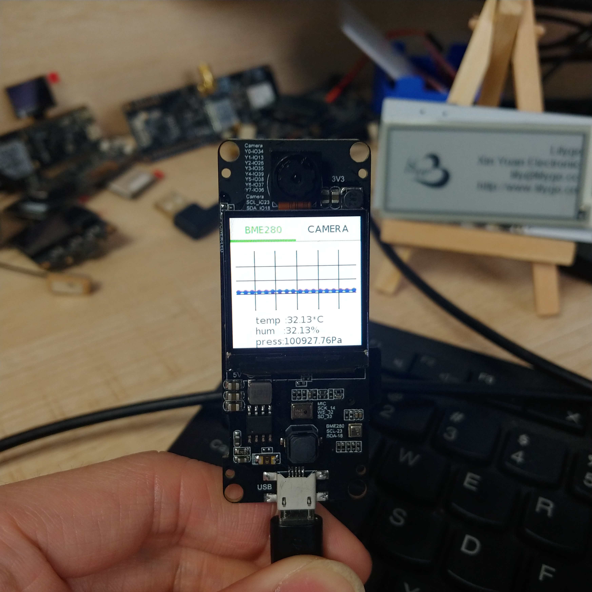
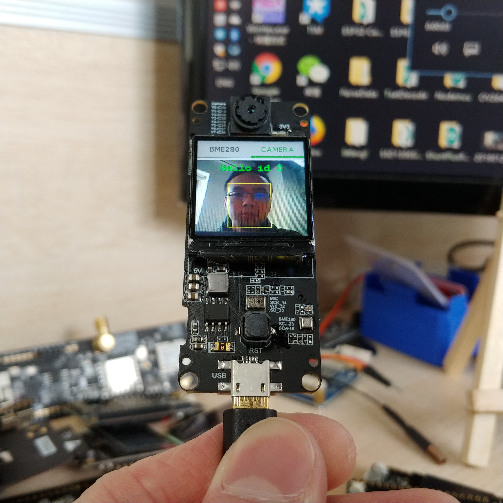

# TTGO Camera Plus

# TTGO Camera && TTGO Camera Plus

| Function    | TTGO T-Câmera     | TTGO T-Câmera Plus   |
| ----------- | ----------------- | -------------------- |
| MIC         | not supported     | supported            |
| SDCard      | not supported     | supported            |
| BME280      | supported         | supported            |
| Charging    | supported         | supported            |
| I2C         | supported         | supported            |
| Screen      | OLED SSD1306/0.96 | IPS Panel ST7789/1.3 |
| Camera      | OV2640            | OV2640               |
| PIR         | supported         | not supported        |
| User button | supported         | not supported        |
| Core        | ESP32-WROVER-B    | ESP32-DOWDQ6         |
| PSRAM       | 8MBytes           | 8MBytes              |
| FLASH       | 4MBytes           | 4MBytes              |
| UART        | CP2104            | CP2104               |

- The SCCB driver in esp-who uses the IO emulation method. I rewrote it to I2C to drive it so that I can mount multiple devices on the I2C bus ,Need to replace `sccp.c` in the SCCB directory with `esp-who/components/esp32-camera/driver/sccb.c`

- At present, the program is not stable, and the wake-up of the voice conflicts with a certain part of the program. Since the voice wake-up code cannot be viewed, this problem cannot be solved. The code just demonstrates that the TTGO Camera Plus board hardware is intact.

- Since TTGO Camera Plus does not have physical buttons, face information entry will be entered on the web page.

- Turn on the `FACE_DETECT_IN_SCREEN` macro(in main.cpp), face recognition will be displayed in the display, and the microphone will be disabled. The web page will not be viewable. Only face input and camera parameters can be adjusted.

## TTGO CAMERA PINS
| Name  | Num    |
| ----- | ------ |
| Y9    | 36     |
| Y8    | 37     |
| Y7    | 28     |
| Y6    | 39     |
| Y5    | 35     |
| Y4    | 26     |
| Y3    | 13     |
| Y2    | 34     |
| VSNC  | 5      |
| HREF  | 27     |
| PCLK  | 25     |
| XCLK  | 4      |
| SIOD  | 18     |
| SIOC  | 23     |
| PWD   | No use |
| RESET | No use |

## BME280  & IP5306 Pins
| Name | Num |
| ---- | --- |
| SDA  | 18  |
| SCL  | 23  |

## MIC  Pins
| Name     | Num    |
| -------- | ------ |
| I2S_SCLK | 14     |
| I2S_LCLK | 32     |
| I2S_DOUT | 33     |
| I2S_DIN  | No use |

## TFT & SD Card Pins
| Name   | Num |
| ------ | --- |
| MISO   | 22  |
| MOSI   | 19  |
| CLK    | 21  |
| DC     | 15  |
| TFT_CS | 12  |
| TFT_BK | 2   |
| SD_CS  | 0   |

